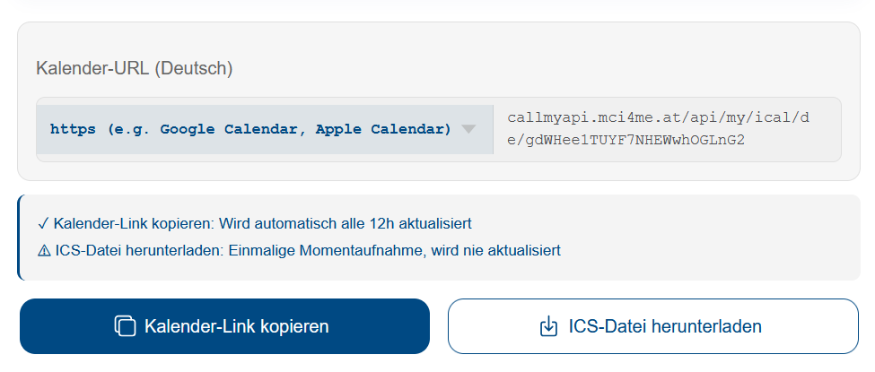

# MCI Anwesenheitscheck

Automatische Anwesenheitsverwaltung für MCI-Studierende als Google Sheets Add-on.

## Features

- Kalender-Import aus MCI ICS-Feed
- Automatische Anwesenheits-Tracking pro Kurs
- Anwesenheits-% und Puffer-Berechnung (75%-Regel)
- Farbliche Hervorhebung: vergangene Termine (violett), heute (gelb)
- Täglicher Auto-Check um 00:01 mit Banner-Benachrichtigung bei Änderungen
- Optionale E-Mail-Benachrichtigung um 07:00
- UE-Verwaltung mit manuellen Overrides
- Änderungs-Log

## Installation

1. Erstelle ein neues Google Sheet
2. Öffne **Erweiterungen → Apps Script**
3. Lösche den bestehenden Code in `Code.gs`
4. Kopiere den Inhalt von `Wrapper.gs` aus diesem Repo in den Editor
5. Gehe links auf **Projekteinstellungen** (Zahnrad) → aktiviere **"Manifestdatei 'appsscript.json' im Editor anzeigen"**
6. Wechsle zurück zum **Editor** und ersetze den Inhalt der `appsscript.json` mit dem Inhalt aus diesem Repo
   > Die Library-Verbindung wird automatisch hergestellt – du musst nichts manuell hinzufügen.
7. Speichern und Sheet neu laden
8. Das Menü **📅 Anwesenheit** erscheint oben

## Kalender-Link besorgen

1. Gehe zu [my.mci4me.at/dates/calendarexport](https://my.mci4me.at/dates/calendarexport) und logge dich ein
2. Wähle **Deutsch** als Kalender-Sprache (wichtig!)
3. Klicke auf **Kalender-Link kopieren**

> **Hinweis:** Der deutsche Kalender ist Pflicht. Das Script nutzt deutsche Begriffe wie "Klausur", "Abgabetermin" und "Unterrichtseinheiten" zur Erkennung.

## Einrichtung

1. Klicke auf **📅 Anwesenheit → Plan erstellen / neu einrichten**
2. Füge deinen MCI ICS-Kalender-Link ein
3. Wähle deine Lehrveranstaltungen aus
4. Prüfe die Unterrichtseinheiten → Fertig!

## Nutzung

### Anwesenheit eintragen

Klicke in der Zeile **Anwesend?** auf eine Zelle und wähle:
- **Ja** – Du warst anwesend (grün)
- **Nein** – Du warst nicht da (rot)
- **Entfallen** – Der Termin wurde abgesagt (grau)

### Termine aktualisieren

Wenn sich im Kalender etwas ändert:
1. Klicke **📅 Anwesenheit → Termine aktualisieren**
2. Das Script zeigt dir die Änderungen
3. Du entscheidest pro Termin: Verschieben / Entfernen / Hinzufügen

## Berechtigungen

Beim ersten Ausführen fragt Google nach Berechtigungen. Klicke auf **Erweitert → Zu [Projektname] wechseln** um fortzufahren.

## Lizenz

Dieses Tool erfordert eine Freischaltung. Kontaktiere den Entwickler für Zugang.